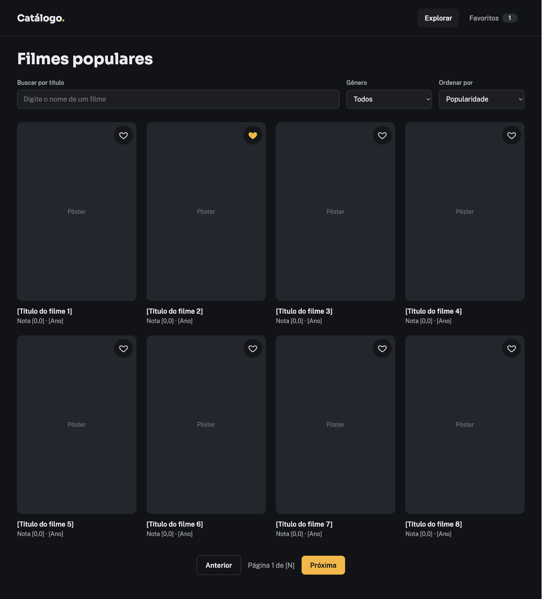

# Catálogo de Filmes



## 💬 Descrição

O Catálogo de Filmes é uma aplicação web para descobrir filmes populares, encontrar títulos por busca e gênero, ordenar resultados e consultar detalhes como sinopse, nota, elenco e trailers. Também permite salvar filmes favoritos para acessá-los novamente.

## ✨ Funcionalidades

- [ ] Listagem de filmes populares com paginação;
- [ ] Busca por título;
- [ ] Filtro por gênero;
- [ ] Ordenação por popularidade, nota e data de lançamento;
- [ ] Página de detalhe em `/movie/[id]` com sinopse, nota, elenco principal e trailer, quando houver;
- [ ] Favoritos com persistência no client e uma página ou aba que liste os favoritos.

## 🌐 Ambientes

### Local

O servidor de desenvolvimento fica disponível em [localhost:3000](http://localhost:3000) após iniciar a aplicação.

### Produção

Aplicação: [teste-tecnico-upflow.vercel.app](https://teste-tecnico-upflow.vercel.app/).

## 🚀 Começando

### Pré-requisitos

- [Node.js](https://nodejs.org/);
- npm, incluído na instalação do Node.js.

### Instalação e execução

Na raiz do projeto, instale as dependências e inicie o servidor de desenvolvimento:

```bash
npm install
npm run dev
```

Abra [http://localhost:3000](http://localhost:3000) no navegador.

## 🚀 Tecnologias

- [Next.js 16](https://nextjs.org/) e [React 19](https://react.dev/) — aplicação web e componentes;
- [TypeScript](https://www.typescriptlang.org/) — tipagem estática;
- [Tailwind CSS 4](https://tailwindcss.com/) — estilos;
- [ESLint 9](https://eslint.org/) — análise estática do código.

## 🏗️ Arquitetura

A aplicação é um frontend Next.js com App Router. A página inicial está em `app/page.tsx`, o layout global e os metadados em `app/layout.tsx`, e o cabeçalho compartilhado em `components/Header.tsx`. Ainda não há backend, persistência de dados ou integração com serviços externos.

## 🧭 Decisões técnicas e trade-offs

- **Next.js com App Router e TypeScript:** tecnologias definidas pelo enunciado, usadas como base da aplicação;
- **Aplicação frontend sem backend próprio:** a estrutura atual mantém a aplicação concentrada no Next.js; ainda não há backend nem integração com serviços externos;
- **Persistência de favoritos:** é um requisito funcional, mas ainda não está implementado no projeto atual.

## 🔌 API

O projeto deve consumir a [API pública do TMDB](https://developer.themoviedb.org), conforme o enunciado do teste. A integração ainda não está implementada e nenhuma rota de dados está disponível no projeto atual.

## 🎨 Layout e design system

As imagens de referência para as telas de filmes populares, detalhe do filme e favoritos estão em [`design-references/stitch/`](./design-references/stitch/). As cores, tipografia e estilos globais atuais estão definidos em `app/globals.css`; a interface final ainda não foi implementada.

## ✅ Testes e validações

O projeto ainda não tem suíte de testes automatizados. Para executar a validação disponível:

```bash
npm run lint
```

## 📁 Estrutura do projeto

```text
app/                          # Página inicial, layout, estilos globais e favicon
components/                   # Componentes reutilizáveis, incluindo o cabeçalho
design-references/stitch/     # Referências visuais das telas
public/                       # Arquivos estáticos públicos
package.json                  # Dependências e scripts do projeto
```

## Acompanhamento

As alterações no projeto podem ser acompanhadas no [GitHub Projects](https://github.com/users/zehguilherme/projects/18).
